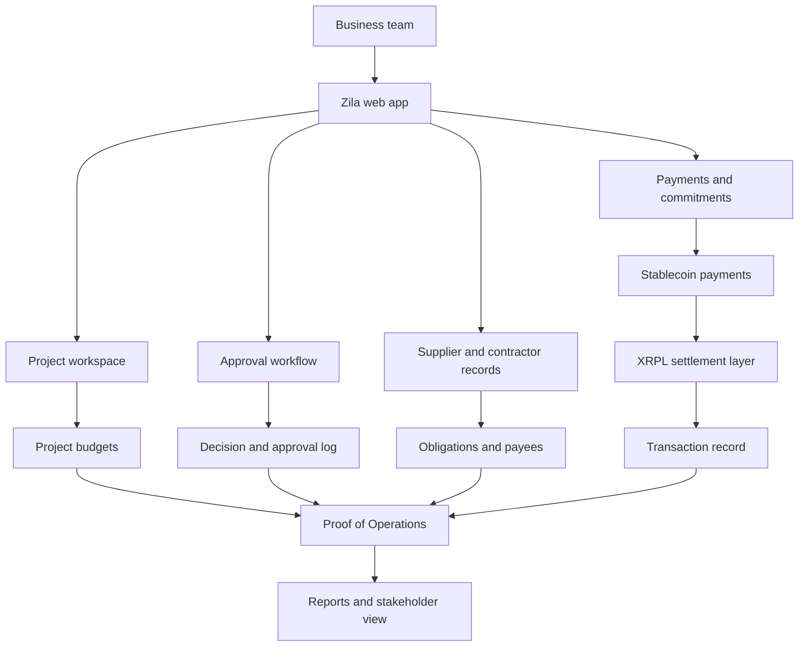

# Zila

Zila is a financial operations system for project based businesses managing money, approvals, commitments, and payments across borders.

## Why I am building this

Businesses do not operate in one place anymore.

A single project can involve a client in one country, suppliers in another, contractors on the ground, remote team members, and money moving through banks, mobile money, stablecoins, and different currencies.

But many of the tools used to manage business finance still assume the operation is simple: one company, one country, one bank account, one currency.

That is not how many businesses actually work.

In project based work, every financial decision is connected. One supplier commitment, one FX movement, one unexpected cost increase, or one delayed approval can affect the whole operation.

Zila is being built for that reality.

## What Zila does

Zila helps teams coordinate how money moves through a project, from commitment to approval to payment to proof.

The goal is to help a business understand:

* What has been paid
* What is still owed
* What has already been committed
* Who needs to approve the next move
* What is safe to pay or hold
* How each payment connects to the wider project

Zila is not just a place to view transactions after they happen. It is being built to help teams manage the decisions that happen before, during, and after money moves.

## The problem

Project based businesses often run on top of several financial systems at once.

A team might receive client money through a bank account, pay local suppliers through mobile money, use stablecoins for cross border settlement, track budgets in spreadsheets, and approve payments through messages.

That creates a gap between the money movement and the operational reality of the project.

The payment may be complete, but the team may still be asking:

* Was this payment approved?
* Was it tied to the right supplier?
* Has the commitment changed?
* Did the FX movement affect the budget?
* What is still owed?
* What can we safely move next?

Zila is designed to close that gap.

## Current MVP

The current MVP focuses on project based financial coordination and stablecoin enabled payment activity.

The MVP includes:

* Project creation and management
* Project budgets
* Supplier and contractor records
* Payment commitments
* Approval workflows
* Stablecoin enabled payment flow
* XRPL transaction record
* Proof of Operations reporting concept

The first version is focused on proving the core workflow: how a business can coordinate commitments, approvals, payments, and proof across a project.

## XRPL integration

Zila uses XRPL as the settlement and proof layer for cross border stablecoin enabled payments.

For this MVP, XRPL supports the payment record and transaction layer. The longer term goal is to connect XRPL based settlement with the operational context around each payment.

That means the payment record is not separate from the business activity behind it. It can be connected to the supplier, the project, the approval, the commitment, and the decision that caused the money to move.

## Why XRPL matters for Zila

Zila is focused on businesses operating across borders, currencies, and payment rails.

XRPL is relevant because it supports fast and low cost settlement, which is important for businesses that need to move value across markets more efficiently.

For Zila, XRPL can support:

* Cross border stablecoin payments
* Faster settlement between project stakeholders
* Clearer transaction records
* A stronger proof layer for business operations
* Payment activity connected to real project decisions

Zila is not using blockchain as a feature added on top. The aim is to use XRPL as part of the financial operating layer for businesses that already need better ways to move, manage, and prove money movement across borders.

## Technical architecture

Zila is currently built as a web based MVP.

The system connects the user interface, project data, supplier records, approval workflows, payment activity, and XRPL transaction records into one operating layer.

## System components

### Zila web app

The main interface where a business can create projects, add suppliers, track obligations, approve payments, and manage project financial activity.

### Project workspace

Each project acts as the operating space for budgets, commitments, suppliers, payments, approvals, and proof records.

### Payments and commitments

This part of the system helps teams track what has been paid, what is still owed, what has already been committed, and what needs to happen next.

### Approval workflow

Zila connects payment activity to decision making. Teams can approve, delay, or review financial actions before money moves.

### Supplier and contractor records

Zila helps teams manage the people and businesses connected to a project, including suppliers, contractors, freelancers, and project partners.

### XRPL settlement layer

XRPL is used as the settlement and transaction record layer for stablecoin enabled cross border payment activity.

### Proof of Operations

Proof of Operations is Zila’s long term record layer. It is designed to show how money moved through a project, who approved it, what was committed, and how key financial decisions were made.

## Product direction

The long term vision is for Zila to become the financial operations layer for cross border businesses.

Future versions will support coordination across multiple payment rails, including banks, mobile money, and stablecoins.

Planned development includes:

* Bank and mobile money partner integrations
* Multi currency project tracking
* Supplier payment scheduling
* Expanded approval workflows
* Operational risk alerts
* Exportable stakeholder reports
* Proof of Operations history for investors, lenders, clients, and internal teams

## Tech stack

Current stack:

* React
* Vite
* Tailwind CSS
* Supabase
* XRPL
* Xaman wallet integration
* Vercel

This stack may change as the product moves from MVP to pilot.

## Status

Zila is currently at MVP stage.

The current version is being used to demonstrate the core workflow for project based financial coordination, cross border stablecoin payments, approvals, supplier obligations, and Proof of Operations.

## Live demo

Live app: add link here

Demo video: add link here if available

## Founder

Zila is built by April Walker.

April is a founder and operator working at the intersection of financial operations, cross border payments, emerging markets, and XRPL infrastructure.
